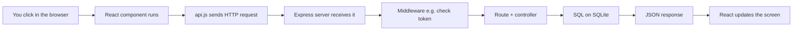

# SignPortal — Beginner’s guide

This document is for you if you are **new to this codebase** or **new to full-stack web apps**. It explains **what to do first**, **what common words mean**, and **how the moving parts fit together**.

You do **not** need to know React, Express, or databases before you start. When you see an unfamiliar word, jump to the [glossary](#glossary-simple-definitions) or search the web—both are normal.

**Related docs**

| If you want… | Open… |
|--------------|--------|
| Install Node, run servers, default login | [README.md](README.md) |
| A map of folders and files | [CODEBASE.md](CODEBASE.md) |

---

## What you’ll get out of this guide

After you work through it (you can skim later sections on the first pass), you should be able to:

- Run the app locally and tell **frontend** vs **backend** apart.
- Picture **one user action** traveling from the browser to the server and back.
- Open the right **files** when someone says “where is the API for documents?” or “where is the database defined?”
- Understand **why** login uses a token (JWT) and why **security rules** belong on the server.

**Rough time:** 30–60 minutes with the app running, longer if you trace code in the editor.

---

## Words you’ll see right away (30-second primer)

| Word | In one sentence |
|------|------------------|
| **Terminal** | A text window where you type commands (`cd`, `npm install`) instead of clicking icons. |
| **`cd`** | “Change directory”—move into a folder (e.g. `cd backend` means “go into the `backend` folder”). |
| **`npm`** | Node’s package manager: installs libraries and runs scripts from `package.json`. |
| **localhost** | “This computer”—`http://localhost:5000` means “port 5000 on my machine”. |
| **Port** | A number (like 5000 or 5173) so multiple programs can listen on the same computer without mixing traffic. |

---

## How to use this guide (read in order)

| Step | Section | Goal |
|------|---------|------|
| 1 | [Run the app first](#step-1-run-the-app-first) | See it working before reading code. |
| 2 | [Two halves of the project](#step-2-two-halves-of-the-project) | Learn “frontend” vs “backend”. |
| 3 | [Follow one button click](#step-3-follow-one-button-click) | See data flow from screen → server → database. |
| 4 | [Tables in the database](#step-4-tables-in-the-database) | Understand what is stored where. |
| 5 | [Login and JWT](#step-5-login-and-jwt-very-short) | Understand how the site knows who you are. |
| 6 | [When you’re ready, go deeper](#step-6-when-youre-ready-go-deeper) | API map, important files, CORS, env vars, tests. |

---

## Step 1: Run the app first

**Why this step matters:** Once the app is open in your browser, every explanation below has something concrete to attach to.

### Where is “the project”?

The **project root** is the folder that contains **both** `backend/` and `frontend/` (often named `SignPortal`). In the terminal, `cd` into that folder first, then `cd backend` or `cd frontend` as needed.

### Why two terminal windows?

The **backend** and **frontend** are two separate programs. Each needs its own process. One terminal runs the API; the other runs the web UI.

### Commands (copy-paste friendly)

**Terminal 1 — backend**

```bash
cd backend
npm install
npm run init-db
npm run dev
```

- Run **`npm run init-db`** the first time you clone the repo, or when you want a **fresh** database (this resets local data—see [README.md](README.md)).
- Leave this terminal open. The API usually listens at **http://localhost:5000**.

**Terminal 2 — frontend**

```bash
cd frontend
npm install
npm run dev
```

- Open the URL Vite prints (often **http://localhost:5173**).

### After it runs

1. **Register** a user or **log in** (after `init-db`, a default admin may exist—see [README.md](README.md); change that password after first login).
2. **Upload** a sample file if you can, and click around so you’ve seen the main screens.

### Quick health check

With the backend running, open **http://localhost:5000/api/health** in the browser. You should see a small JSON “ok” response. If this fails, fix the backend before chasing errors in the React app.

### Try this: watch the network

1. In the browser, open **Developer tools** (often F12) → **Network**.
2. Click something that loads documents (or log in).
3. Find a request whose name relates to **`documents`** or **`auth`**.

You are watching the **frontend ask the backend for data**—that is the core idea of this project.

### If something fails

| Symptom | What to try |
|---------|-------------|
| “Port 5000 already in use” | Another program is using that port. Stop the old server: from the repo root see [README.md](README.md) (`npm run stop` on Windows), or set `PORT` in `backend/.env`. |
| Login never works right after clone | From `backend/`, run **`npm run init-db`** once. |
| React errors but Network shows **no** calls to your API | The UI may be pointing at the wrong server. Check `frontend/src/utils/constants.js` (and any `VITE_API_URL`) matches `http://localhost:5000` (or your chosen port). |
| `npm` command not found | Install **Node.js** from [nodejs.org](https://nodejs.org); restart the terminal. |

### Stop the servers

From the project root, see [README.md](README.md) (e.g. `npm run stop` on Windows).

---

## Step 2: Two halves of the project

| Half | Folder | Plain-language job |
|------|--------|---------------------|
| **Frontend** | `frontend/` | What you **see and click**: pages, buttons, forms. Built with **React** (UI) and **Vite** (dev tooling). |
| **Backend** | `backend/` | The **server**: checks passwords, stores data, answers HTTP requests with **JSON**. Built with **Node.js** and **Express**. |

They talk over **HTTP**—the same family of technology as loading a web page, but the answers are usually **data** (JSON), not a full HTML page.

The frontend’s API base URL is often **`http://localhost:5000/api`** (see `frontend/src/utils/constants.js`).

### One rule to remember

If the rule is “only **admins** can delete this,” that check must happen on the **backend**. The frontend can **hide** a delete button for non-admins, but anyone could still call the API with the right URL. The server must **enforce** the rule.

---

## Step 3: Follow one button click

Example: you open the **document list**. Roughly this happens, in order:



1. **React** runs code in a **page** or **component** (`frontend/src/pages/` or `frontend/src/components/`).
2. That code uses **`frontend/src/services/api.js`** to send an HTTP request (**GET** = fetch data, **POST** = send data—see glossary).
3. If you’re logged in, the request may include a **token** (Step 5)—proof of who you are.
4. **Express** (`backend/src/server.js`) receives the request and forwards it to a **route** under `backend/src/routes/` (e.g. `documents.js`).
5. **Middleware** may run first (e.g. “is this token valid?”).
6. A **controller** in `backend/src/controllers/` runs **SQL** against **SQLite** (a database file on disk).
7. The server returns **JSON**. React updates what you see.

### Exercise (15 minutes)

Pick a screen you like (e.g. Documents). Search the repo for **`documentsAPI`** or the path **`/documents`**. Follow one function from a button or page load → `api.js` → a matching line in `backend/src/routes/documents.js`. You don’t need to understand every line—just see the **path** the request takes.

---

## Step 4: Tables in the database

The database **structure** (tables and columns) lives in **`backend/src/config/schema.sql`**. You don’t need to memorize it—use this table as a **map**.

| Table | Meaning in plain language |
|-------|---------------------------|
| **users** | People who can sign in. Each has a **role** (e.g. personnel, authority, admin). |
| **documents** | One uploaded file and its metadata (title, status, deadline, …). File bytes may be stored in a **BLOB** (binary inside the database). |
| **workflow_stages** | Steps a document goes through (who signs or approves next). |
| **signatures** | A saved signature for a stage (drawn or image). |
| **document_attachments** | Extra files linked to a document. |
| **document_versions** | New versions of the file as the workflow progresses. |
| **notifications** | In-app alerts. |
| **document_history** | An audit-style log of actions. |
| **workflow_comments** | Comments on a workflow step. |

**Relationship in one line:** one **document** has many **workflow_stages**; stages can have **signatures**. Think: **file → steps on that file → signatures on a step**.

---

## Step 5: Login and JWT (very short)

1. You send **email + password** to the backend.
2. If they match, the server returns a **JWT** (a signed string). The frontend often stores it in **localStorage** (browser storage for this site).
3. Later requests send a header like: `Authorization: Bearer <that string>`.
4. The backend **verifies** the JWT and knows your user id and **role** without asking for your password every time.

If the token is invalid or expired, the API may return **401 Unauthorized**; the app often **logs you out** and sends you to the login page.

**Again:** hiding a menu in React is **not** security. The **server** must check roles on sensitive routes.

---

## Step 6: When you’re ready, go deeper

### Main API areas (after `/api`)

| Path prefix | What it’s for |
|-------------|----------------|
| `/auth` | Register, login, “who am I”. |
| `/documents` | Upload, list, download; versioning often under the same area. |
| `/workflow` | Stages, approvals, moving the workflow forward. |
| `/signatures` | Save and load signatures. |
| `/notifications` | List notifications, mark read/unread. |

Attachments often live under paths like **`/documents/:id/attachments`**—see `backend/src/routes/attachments.js`.

### Important files (starter list)

| File | Why it matters |
|------|----------------|
| `backend/src/server.js` | Backend starts here; routes are wired up. |
| `frontend/src/main.jsx` → `App.jsx` | Frontend starts here. |
| `frontend/src/services/api.js` | Central place for HTTP calls to the API. |
| `backend/src/config/database.js` | Connects to SQLite. |
| `backend/src/config/schema.sql` | Table definitions. |

### CORS (one sentence)

Browsers block a page on **one port** (e.g. 5173) from calling an API on **another port** (e.g. 5000) unless the **API server** allows it—that mechanism is **CORS**. This repo allows localhost in development; production should use a **strict** allowlist.

### Environment variables

Values like **PORT**, **JWT_SECRET**, and **DB_PATH** come from environment variables or defaults—see [README.md](README.md). **Never** commit a real **JWT_SECRET** to a public repository.

### Tests

From `backend/`, **`npm run test`** runs **smoke** checks (basic “does the API still respond?”). It is not a full test suite, but it’s a quick sanity check after changes.

---

## What you can practice on with this project

The repo already includes ideas you’ll see in many jobs: **login and roles**, **file upload**, **multi-step workflow**, **signatures**, **versions**, **attachments**, **notifications**, and a **dashboard**.

**Typical “next step” projects:** richer admin tools, email notifications, in-browser file preview, harder production security, and more automated tests.

---

## FAQ (beginner)

**Do I need to learn SQL first?**  
No. You can use the app and read this guide first; open `schema.sql` when you’re curious how data is shaped.

**What if I only know HTML/CSS?**  
You can still run the app and explore. The UI is built in **React** (JavaScript). Tutorials on “React basics” will help when you open `frontend/src`.

**Is the database a separate app I install?**  
No. **SQLite** is a library; data is usually in a file like `signingportal.db` under `backend/` (exact path may depend on config).

**What’s the difference between “route” in React and on the server?**  
**React Router** picks which **screen** to show. **Express routes** pick which **server function** runs for a URL like `/api/documents`. Same word, two layers.

---

## Glossary (simple definitions)

| Word | Meaning |
|------|---------|
| **API** | The backend’s HTTP “menu”—URLs that return **JSON** data instead of a full web page. |
| **JSON** | A text format for structured data (lists, objects, strings, numbers) sent between browser and server. |
| **GET / POST** | **GET** usually **reads** data; **POST** usually **sends** new data (uploads, forms). (There are other verbs; these are the common ones.) |
| **React** | A JavaScript library for building UI in reusable **components**. |
| **Route** | A URL pattern on the server (or a path in the SPA) tied to specific code. |
| **Middleware** | Server code that runs **before** the main handler (e.g. “parse JSON body,” “check JWT”). |
| **SQLite** | A small embedded database; often one file on disk. |
| **BLOB** | Binary large object—raw file bytes stored inside a database cell. |
| **JWT** | A compact signed token from the server after login; proves identity on later requests. |
| **SPA** | Single-page application: one HTML load, then JavaScript swaps views. |
| **401** | HTTP status: “not authenticated” (e.g. bad or missing token). |

---

## More reading (optional)

| File | Why |
|------|-----|
| [CODEBASE.md](CODEBASE.md) | Folder-by-folder orientation. |
| [backend/docs/ACCESS_CONTROL.md](backend/docs/ACCESS_CONTROL.md) | Who can do what. |
| [backend/docs/TEST_GUIDE.md](backend/docs/TEST_GUIDE.md) | Backend tests in more detail. |
| [samples/](samples/) | Sample data for practice. |
| [backend/src/config/schema.sql](backend/src/config/schema.sql) | Exact columns and tables. |

---

*Last updated: 26 April 2026.*
